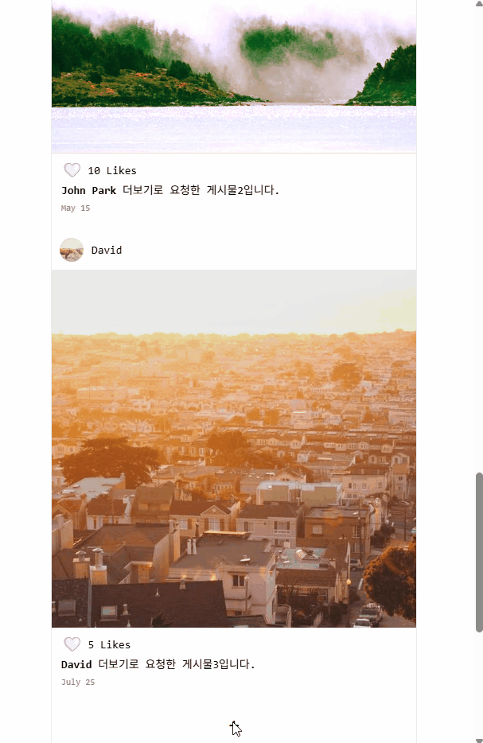
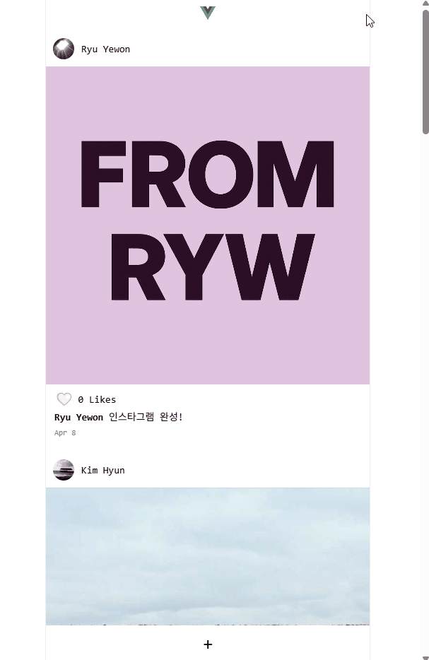

# 인스타그램 클론 프로젝트 (Vue.js 3)

[배포된 사이트 바로가기](https://dulcet-cocada-7efa1f.netlify.app)

이 프로젝트는 [코딩애플 - 인스타그램을 만들며 배워보는 Vue.js 3 완벽 가이드](https://codingapple.com/) 강의를 기반으로 제작되었습니다.  
강의에서 제공된 기본 코드를 바탕으로 **Vue 3 Composition API 문법에 맞게 수정**하고,  
직접 기능을 구현하거나 개선하여 **학습 목적의 클론 프로젝트**로 완성하였습니다.

> ⚠️ 본 프로젝트는 교육 및 포트폴리오 용도로만 사용되며, 상업적 용도는 아닙니다.

 

## ✨ 주요 구현 기능

- 이미지 업로드 및 미리보기
- 필터 선택 기능 (여러 가지 필터 중 선택 가능)
- 게시글 내용 작성 기능
   
   

- 좋아요 토글 (하트 애니메이션 포함)
   
   

- 스크롤 하단 감지 시 다음 게시물 자동 불러오기(더보기)

 

## 🔧 사용 기술 스택

| 영역       | 기술                                         |
| ---------- | -------------------------------------------- |
| 프레임워크 | Vue.js 3 (Composition API)                   |
| 빌드 도구  | Vite                                         |
| 상태관리   | ref, reactive, props, emits 등 Vue 기본 기능 |
| HTTP 통신  | Axios                                        |
| 배포       | Netlify                                      |
